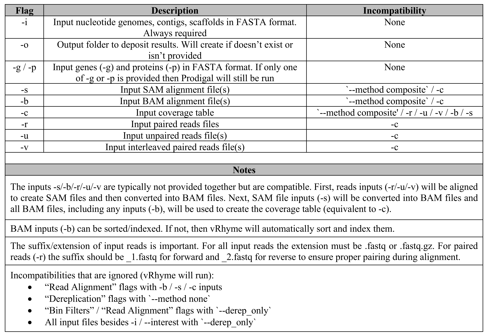

<p align="center">  </p>

# **vRhyme**
### Binning Virus Genomes from Metagenomes

```
December 2021   
Kristopher Kieft  
kieft@wisc.edu  
Anantharaman Lab  
University of Wisconsin-Madison  
```

## Current Version
vRhyme v1.0.0  

## Citation
If you find vRhyme useful please consider citing our manuscript on [bioRxiv](https://doi.org/10.1101/2021.12.16.473018):  
Kieft, K., Adams, A., Salamzade, R., Kalan, L., & Anantharaman, K. vRhyme enables binning of viral genomes from metagenomes. bioRxiv, 2021.  

______
## Table of Contents:
1. [Updates](#updates)
    * **v1.0.0**
2. [Program Description](#program)
3. [Installation](#install)
4. [Requirements](#require)
    * Program Dependencies
    * Python3 Dependencies
5. [Running vRhyme](#run)
    * Test examples
    * Quick run examples
6. [Output Explanations](#out)
    * Useful outputs
    * Other outputs
7. [Interpreting vRhyme bins/vMAGs](#interpret)
8. [vRhyme Files and Folders](#ff)
9. [vRhyme Flag Descriptions](#flags)
    * Flag compatibility
    * Commonly used flags
    * Other flags
10.  [Contact](#contact)

______
## Updates for v1.0.0 (December 2021): <a name="updates"></a>
* Initial release  
* Fixed pip install bugs   


______
## Program Description <a name="program"></a>

#### **vRhyme Description**
vRhyme is a multi-functional tool for binning virus genomes from metagenomes. vRhyme functions by utilizing coverage variance comparisons and supervised machine learning classification of sequence features to construct viral metagenome-assembled genomes (vMAGs).  

*IMPORTANT NOTE*: vRhyme is built to run on viral sequences/scaffolds. A typical workflow is to predict viruses from a metagenome (e.g., with VIBRANT or VirSorter) and then use those predictions as input to vRhyme. vRhyme can take an entire metagenome as input, but the performance for a whole metagenome has not been fully evaluated. vRhyme is not meant to bin microbes.  

Why "*vRhyme*"? The similarity in sequence features between two scaffolds can be used to identify fragments of the same genome, such as tetranucleotide frequencies, codon usage or GC content. It's almost like rhyming sequences together to create pairs that sound similar, at least metaphorically at the nucleotide level. Coverage variance helps to separate scaffolds that sound the same but are actually different genomes.  


#### **vRhyme Features**
* Binning vMAGs
* Automatic bin refinement
* Automatic read coverage calculation and refinement
* Bin scoring and redundancy checks (Mmseqs2)
* Supervised machine learning: neural networks and decision trees 
* Scaffold dereplication (Mash, Nucmer)
* Read alignment (Bowtie2, BWA)
* ORF prediction (Prodigal)

______
## Installation <a name="install"></a>
  
#### **GitHub, pip, and conda**
1. `git clone https://github.com/AnantharamanLab/vRhyme`  
2. *optional* create a conda environment (see examples below)  
3. *optional* activate conda environment if you made one  
4. `cd vRhyme`  
5. `pip install .`    *&#8592; NOTE*: don't forget the dot (`pip install [dot]`)  
  
Installing with pip is optional but suggested. Using pip will collect Python dependencies and add vRhyme to your system PATH. Note that `vRhyme.egg-info` and `build` should be created after the pip install. Without pip, vRhyme can still be executed directly from the git clone, just ensure executable permissions (`cd vRhyme/; chmod +x vRhyme scripts/*.py aux/*.py`). The conda environment is also optional but can be useful for downloading and managing program dependencies.  
  
#### **Example Conda Environments**
* with pip install  
   1. `conda create -c bioconda -n vRhyme python=3 samtools mash mummer mmseqs2 prodigal bowtie2 bwa`  
   2. `conda activate vRhyme`  
  
* directly from git clone  
   1. `conda create -c bioconda -n vRhyme python=3 pandas numpy numba scikit-learn pysam samtools mash mummer mmseqs2 prodigal bowtie2 bwa`  
   2. `conda activate vRhyme`  
  
#### **Test the Installation**
Test and validate the installed dependencies for vRhyme. In these tests you're looking for *Success* statements. All Python dependencies must be *Success*. Please update them if prompted. Both machine learning models must be *Success*. For program dependencies, only Mmseqs is required to be *Success*, the others are optional depending on vRhyme usage. If you use any coverage input beside `-c` then Samtools is required to be *Success*. If you skip vRhyme `-p` or `-g` flags then Prodigal must be *Success*. If you plan to use vRhyme's dereplication function (see `--method`) then Mash and Nucmer must be *Success*. If you input reads (`-r/-v/-u`) then Bowtie2 and/or BWA (see `--aligner`) must be *Success*.  
  
* with pip install  
   `test_vRhyme.py`  

* directly from git clone  
   `aux/test_vRhyme.py`  

Print the main vRhyme help page:  
`vRhyme -h`  
  
______
## Requirements <a name="require"></a>

#### **Program Dependencies**
Please ensure the following programs are installed and in your machine's PATH. Note: most downloads will automatically place these programs in your PATH. See each program's source website for installation guides.  
 
##### **Required**  
1. [Python3](https://www.python.org) (version >= 3.6)
2. [Mmseqs2](https://github.com/soedinglab/MMseqs2)
3. [Samtools](http://www.htslib.org/)
##### **Optional (depends on usage)** 
4. [Prodigal](https://github.com/hyattpd/Prodigal/wiki/installation)
5. [Mash](https://github.com/marbl/mash) 
6. [Nucmer](https://mummer4.github.io/install/install.html)  
7. [Bowtie2](http://bowtie-bio.sourceforge.net/bowtie2/manual.shtml)  
8. [BWA](https://github.com/lh3/bwa)  


#### **Python3 Dependencies**
There are several Python3 dependencies that must be installed as well. You may already have most of these installed. See each package's source website for installation guides. Versions are important.  

1. [Pandas](https://pandas.pydata.org/pandas-docs/stable/getting_started/install.html) (version >= 1.0.0)
2. [Numpy](https://numpy.org/install/) (version >= 1.17.0)
3. [Scikit-learn](https://scikit-learn.org/stable/install.html) (version >= 0.23.0)
4. [Numba](https://numba.pydata.org/numba-doc/latest/user/installing.html) (version >= 0.50.0)  
5. [PySam](https://github.com/pysam-developers/pysam) (version >= 0.15.0)  


______
## Running vRhyme <a name="run"></a>
  
### Test run examples
Test out vRhyme on the provided example dataset. *NOTE*: If you choose to not install with pip, the `vRhyme` executable is within the `vRhyme/` subdirectory.   

`cd examples/`  

##### **minimal coverage table input example**
`vRhyme -i example_scaffolds.fasta -c example_coverage_values.tsv -t 1`  
  
##### **full coverage table input example**
`vRhyme -i example_scaffolds.fasta -o vRhyme_example_results_coverage-table/ -c example_coverage_values.tsv -p example_scaffolds.prodigal.faa -g example_scaffolds.prodigal.ffn -t 2`  

  
### Quick run examples

##### **minimum input example with bam files**
`vRhyme -i fasta -b bam_folder/*.bam`  
  
##### **minimum input example with a coverage file**
`vRhyme -i fasta -c coverage_file.tsv`  
  
##### **full BAM input example**
`vRhyme -i fasta -g genes -p proteins -b bam_folder/*.bam -t threads -o output_folder/`  
  
##### **reads input example with dereplication**
`vRhyme -i fasta -g genes -p proteins -r paired_reads_folder/*.fastq -t threads -o output_folder --method longest`  
  
##### **only use dereplicate function**
`vRhyme -i input_fasta -t threads -o output_folder/ --derep_only --method longest`  
  
______
## Output Explanations <a name="out"></a>

#### **Useful outputs**
* *log_vRhyme_(-i).log*: main log file
* *vRhyme_best_bins.#.membership.tsv*: scaffold membership of best bins
* *vRhyme_best_bins.#.summary.tsv*: summary stats of best bins
* *vRhyme_best_bins_fasta/*: folder containing fasta files for best bins

#### **Other outputs**
* *log_vRhyme_paired_reads.log*: log of which reads files were paired together with `-r`. Exists with `-r`. 
* *(-i).prodigal.faa*/*(-i).prodigal.ffn*: proteins/genes predicted by Prodigal for the length-filtered input sequences. Exists in the absense of `-p/-g`.
* *vRhyme_machine_distances.tsv*: raw distance calculation values used as input for the machine learning model(s)
* *vRhyme_coverage_files*: folder containing one file per sample with coverage values per scaffold. The row names can be found in *vRhyme_names.txt*. *vRhyme_coverage_values.tsv* is the combination of all sample coverages and is equivalent to `-c`. Does not exist with `-c`. 
* *vRhyme_alternate_bins*: folder containing membership and summary files for each alternative binning iteration. *vRhyme_bin_scoring.tsv* contains the scoring information and rationale for the best iteration chosen as the best bins. 
* *vRhyme_bam_files*: contains vRhyme-generated BAM files. Exists with `-r/-u/-v/-s`. Only sorted BAM files will exist unless `--keep_bam`.
* *vRhyme_sam_files*: contains vRhyme-generated SAM files. Exists with `-r/-u/-v` and `--keep_sam`.

#### **Hierarchy**
* '>' : folder
* '-' : file 
* '\*' : indicates file/folder may not exist 
  
```
> main output folder (-o)
    - log_vRhyme_(-i).log
    - log_vRhyme_paired_reads.log *
    - (-i).prodigal.faa *
    - (-i).prodigal.ffn *
    - vRhyme_best_bins.#.membership.tsv
    - vRhyme_best_bins.#.summary.tsv
    - vRhyme_machine_distances.tsv
    > vRhyme_coverage_files *
        - (sample).coverage.tsv
        - vRhyme_coverage_values.tsv
        - vRhyme_names.txt
    > vRhyme_alternate_bins
        - #.membership.tsv
        - #.summary.tsv
        - vRhyme_bin_scoring.tsv
    > vRhyme_best_bins_fasta
        - vRhyme_bin_#.faa
        - vRhyme_bin_#.fasta
        - vRhyme_bin_#.ffn
    > vRhyme_bam_files *
        - (sample).sorted.bam
        - (sample).bam *
        - (sample).bam.bai *
    > vRhyme_sam_files *
        - (sample).sam
```

______
## Interpreting vRhyme bins/vMAGs <a name="interpret"></a>

The following bullet points are guidelines on interpreting binning results from vRhyme. Please note that this list is not exhaustive. For examples and data, please see analyses done in the vRhyme publication.  
  
* Use protein redundancy as a metric of contamination
  * Contamination: a bin containing sequences from multiple viral genomes
  * Viruses do not encode universal single copy genes and therefore identifying contaminated vMAGs is difficult. For bacteria and archaea, a common practice is to estimate this with the tool CheckM. A useful tool for viruses is CheckV, though CheckV cannot identify if a vMAG contains sequences from multiple viral genomes, though it may identify if the genome is larger than expected. vRhyme implements a "protein redundancy" check for this purpose based on the concept that few viruses encode redundant proteins (e.g., >50% homology). Foremost, protein redundancy is used by vRhyme to construct bins and select the optimal iteration. However, this metric can be used post-binning to filter out bins that are likely contaminated. The vRhyme publication has a supplemental figure for this topic. 
    * Bins unlikely to be contaminated will have 0-1 redundant proteins. 
    * Bins with approximately 2-5 redundant proteins may not be contaminated but there are few such examples. 
    * Bins with >6 redundant proteins are often contaminated. Notable exceptions include NCLDVs, which can have ~10 redundant proteins in an uncontaminated bin. 
* Expected bin sizes
  * Bin size: number of sequences (members)
  * Most vRhyme bins will be just 2-3 members
  * Although some viruses require binning to reconstruct fragmented genomes, there typically aren't many fragments to put back together. Most vRhyme bins will be just 2-3 members and few will exceed 4 members. However, a bin with >4 members should not automatically cause skepticism. In benchmarks, several examples of uncontaminated bins with >4 members were identified. Two examples detailed in the vRhyme publication are a 22-member Herelleviridae vMAG (115kb) and an 11-member NCLDV vMAG (1.6Mb). A megaphage (540kb) artificially split into 51 fragments generated a respective 51-member bin. 
* Unbinned sequences are still useful
  * Unbinned sequences: any input viral sequence that was not placed into a bin
  * Not all viral genomes will require binning and will remain as individual sequences. There is still high utility in unbinned viral sequences as they may accurately represent a viral population/genome. Any unbinned sequence or unused bin (e.g., individual members from bins with contamination) should be combined with the vMAGs for analyses. 
* Prophages can be difficult to bin
  * Prophage: temperate phage integrated into the host genome
  * Prophages can be dormant (non-replicating) or active (replicating)
  * Multiple prophages integrated into the same host genome can cause difficulties if the prophages are dormant. When dormant, read coverage of each prophage generally matches that of the host. Therefore, vRhyme is likely to take multiple prophage genomes from the same host and bin them together, creating a contaminated bin. However, if one or more prophages are active then their read coverages will be distinct and typically lead to accurate binning. There are at least two ways to identify this: 
    * a bin with >1 redundant proteins that encodes 2 integrases, with each integrase on a different sequence
    * a bin with 2 or more sequences that were excised from the same parent sequence, but the excised sequences are not closely localized on the parent sequence. In this example, the parent sequence would be the host and the excised sequences are the predicted prophages. If the predicted prophages are not near each other on the parent then they are likely unique genomes. If they are very near each other on the parent then they may actually be one prophage that was incorrectly split in two by the prophage identification tool. 
* Lytic and lysogenic viruses can bin together
  * Lytic cycle: productive infection that leads to release of viral particles; strictly lytic viruses do not integrate
  * Lysogenic cycle: non-productive infection where viral particles are not released; lysogenic viruses integrate and are dormant until entering the lytic cycle (some exceptions); often encode an integrase
  * When viewing binned sequences that have "lysogenic/lytic" labels from another software (e.g., VIBRANT, VirSorter) it may seem concerning to see a lytic virus bin with a lysogenic virus. Although this may be reason to be skeptical of contamination, here are some explanations of what may be occurring:
    * software tools that label lysogenic/lytic can make mistakes or be misled. For example, if a sequence does not encode an integrase or other lysogenic features then VIBRANT will label it as "lytic". If this is a virus genome fragment and another fragment of the same genome (different sequence) contains an integrase then that other fragment will be labeled as "lysogenic". When binning, those two sequence can be place into the same bin by vRhyme to produce an accurate bin with a lytic and lysogenic member.
    * A bin with one or more lytic members and one lysogenic member should not cause concern.
    * A bin with one or more lytic members and one integrated prophage should be examined.
    * A bin with two or more lysogenic members, each encoding an integrase, is likely contamination.
    * A bin with two or more integrated prophages, regardless of integrases, from multiple parent sequences is likely contamination.

______
## vRhyme files and folders <a name="ff"></a>

* *aux/*: folder containing auxiliary scripts. These scripts are not used when running the main vRhyme software and are intended to be run either pre- or post-binning. For all scripts listed below used `-h` for a help message with usage. 
    * *test_vRhyme.py*: test the installed dependencies for vRhyme.
    * *alternative_bins_to_fasta.py*: if you wish to use an alternative iteration from vRhyme binning this script will extract fasta files per bin for that iteration. 
    * *bin_coverage.py*: calculate the average coverage of a bin per sample (combined averages of all bin members).
    * *coverage_table_convert.py*: convert a MetaBat2 'jgi_summarize_bam_contig_depths' generated coverage table into vRhyme format for -c input.
    * *extract_unbinned_sequences.py*: extract unbinned scaffolds into a separate fasta file.
    * *generate_bin_scores.py*: calculate vRhyme-equivalent scores per bin. This script will run the same protein redundancy and scoring method implemented by vRhyme. Note that in the output table the score will be listed in the final row. 
    * *link_bin_sequences.py*: link scaffolds within a bin to generate a single sequence per bin. This may be useful for CheckV input. Note that after linking scaffolds, if Prodigal is used to predict open reading frames the Prodigal `-m` flag should be used. 
    * *sequence_lengths_of_bins.py*: calculate the total nucleotide length of each bin.
* *example/*: folder containing example tests and output files for validating vRhyme installation and setup. 
* *images/*: folder containing PNG images with the vRhyme flowchart, flag compatibility descriptions, and logo. 
* *models/*: folder containing two machine learning models for the neural network (NN) and extra trees classifiers (ET).
* *scripts/*: folder containing essential scripts that perform vRhyme functions. These scripts are not intended to be used on their own.
* *vRhyme*: main executable.


______
## vRhyme Flags <a name="flags"></a>

### Flag and input compatibility

<p align="center">  </p>

### Flag explanations

##### **Commonly Used**
###### (typical usage inputs and options)
* `-i`: (required) input nucleotide scaffolds. For best results, this is predicted virus scaffolds from a metagenome or entire virome assembly. Alternatively, an entire metagenome can be used as input, but this has not been extensively tested.  
* `-o`: output folder to deposit all results. vRhyme will exit if the folder already exists.
* `-g`: input nucleotide genes in the format 'name_#'.
* `-p`: input amino acid proteins genes in the format 'name_#'.
* `-b`: BAM (extension '.bam') sequence alignment files. The files can sorted or unsorted (each will be checked individually) but vRhyme will use sorted and indexed BAM files for coverage. Example usage: `-b bam_file_folder/*.bam`
* `-t`: number of parallel processes (threads) to run. With `-c/-p/-g` inputs vRhyme runtime is sufficient with low `-t` values (e.g., 1). vRhyme will be most efficient when `-t` is set to the same value as `--iter` such that 1 iteration (`--iter`) is run on 1 thread (`-t`) simultaneously. The same is true for whole integer multiples. For example: `-t 10 --iter 10`, `-t 20 --iter 10`, `-t 30 --iter 15`. Note that any `-t` and `--iter` combination can be used.
* `-l`: minimum scaffold length to consider for binning. The default minimum is 2000bp (2kb) and cannot be reduced. Scaffolds <2kb do not contain enough information for accurate binning and can create erroneous results.

* NOTE: For FASTA inputs (`-i/-g/-p`) most characters are accepted with few exceptions (e.g., pipe symbol `|` and comma `,`).
* NOTE: `-g` and `-p` can be skipped and Prodigal will be used to predict open reading frames
* NOTE: For `-g/-p`, the format 'name_#' is Prodigal format. 'name' can be any sequence name with '_#' designating the protein/gene number. For example, 'example_sequence_1' and 'example_sequence_2' is protein/gene 1 and 2.
* NOTE: Prodigal is run with `-m -p meta`.

##### **Other Inputs**
###### (mostly inputs besides -b)
* `-s`: SAM (extension '.sam') sequence alignment files. vRhyme will convert these files directly to BAM format before processing. Example usage: `-s sam_file_folder/*.sam`
* `-r`: paired forward (_1.fastq/_R1.fastq) and reverse (_2.fastq/_R2.fastq) read files. The extensions and suffix terminology is important to ensure proper pairing during alignment. With this input a file called 'log_vRhyme_paired_reads.tsv' will be created to validate that correct pairing was identified. Example usage: `-r paired_reads_folder/*.fastq`
* `-u`: unpaired (.fastq) read file(s). This is for single end sequencing and will not be considered with `-r`. Example usage: `-u unpaired_reads_folder/*.fastq`
* `-v`: interleaved paired (.fastq) read file(s). Compatible with `--aligner bowtie2` only. Example usage: `-v interleaved_reads_folder/*.fastq`
* `-c`: coverage table input. See the example run for formatting if you want to generated this file manually. This may be useful if re-binning after a coverage table has already be generated by vRhyme or if an error caused vRhyme to exit after the coverage table was created. This input can also come from using cov_table_convert.py on a coverage table generated by 'jgi_summarize_bam_contig_depths'.
* `--interest`: file containing a list of scaffolds of interest to dereplicate and/or bin. Use this if your input (`-i`) file contains more scaffolds than what you want to bin or dereplicate. The list is new line separated.

* NOTE: all read inputs can be in gzip (.gz) format
* NOTE: It is highly suggested to bin using at least 2-3 samples for coverage covariance comparisons (e.g., 3 `-b` input files). vRhyme will still function and bin with 1 sample.
* NOTE: BWA is run with 'mem'. A BWA database/index will be created if it doesn't exist in the location of the `-i` file. Use Bowtie2 or separate read map software of choice for interleaved reads or if reads are improperly formatted for BWA.
* NOTE: Bowtie2 is run with '--no-unal --no-discordant' using `-r` or `-v`. A Bowtie2 database/index will be created if it doesn't exist in the location of the `-i` file.

##### **Edit Outputs**
###### (these typically do not need to be modified and do not effect binning results)
* `--keep_sam`: (bool, just use the flag) If used, do not remove SAM files generated by vRhyme. Otherwise all SAM files generated from vRhyme read alignment will be deleted. All input SAM files (`-s`) are not effected.
* `--keep_bam`: (bool, just use the flag) If used, do not remove unsorted/index BAM files generated by vRhyme. Otherwise all unsorted/index BAM files generated from vRhyme read alignment or SAM conversions will be deleted. All input and final sorted BAM files (`-b`) are not effected.
* `--speed`: (bool, just use the flag) If used, allow extra CPU multithreading per process (may use more CPUs than `-t #` per process). This is effected by the environments OMP_NUM_THREADS, OPENBLAS_NUM_THREADS, MKL_NUM_THREADS, VECLIB_MAXIMUM_THREADS, or NUMEXPR_NUM_THREADS.
* `--verbose`: (bool, just use the flag) If used, write log file information to standard out while running. This is identical to what is written to the log file.
* `--prefix`: The prefix to append to binned scaffold names. The default is 'vRhyme_#\__'. Use the '#' symbol where the bin number will be noted. For example, by using `--prefix BIN_#__` bin 1 will have the prefix 'BIN_1__', bin 2 will be 'BIN_2__' and so on. 

##### **Read Alignment**
###### (select read map software or modify alignment filtering)
* `--aligner`: read alignment software to use. Either 'bowtie2' (default) or 'bwa'. Other alignment software are not supported at this time. Use BAM (`-b`), SAM (`-s`) or coverage table (`-c`) inputs for alignments from other software.
* `--read_id`: minimum percent identity per aligned read for calculating coverage. The default is '0.97' (97%). Percent identity is calculated per read as the number of exact matches divided by the length of the aligned read. Exact matches are calculated by the length of the aligned read minus the number of gaps and mismatches. This is the quality trimming of the read alignment as some reads are aligned at poor identity depending on alignment software settings. This is compatible with reads file inputs or BAM/SAM inputs.
* `--mask`: mask coverage values <\int> bases on each end of a scaffold. The default is 150. For short read alignments the coverages can be skewed at scaffold ends and impact coverage covariance calculations. Masking (not including) these coverage values on each end can produce better results. The default of 150 is suitable for most situations, but changing this value to the average read length may be beneficial.

##### **Bin Filters**
###### (these typically do not need to be modified)
* `--bin_size`: minimum number of scaffolds per bin. The default is 2. For example, setting this to 5 means all reported bins must contain at least 5 scaffolds. Low values, such as 2, are best for binning viruses that have smaller genomes.
* `--iter`: number of binning iterations (presets) to run. The default is 10 and the available range is 8-15. The presets are immutable threshold settings for the machine learning model probability, Cohen's *d* coverage effect size, and network edge weight cutoffs. Each iteration will run a single preset. The minimum setting of 8 is usually sufficient to identify the best binning iteration. There is a maximum of 15 possible presets. Setting `--iter` higher (e.g., 15) has a slight reduction in speed and provides a better opportunity to identify the best binning iteration, though the presets that typically result in the best binning iterations are 0 to 7.
* `--red`: maximum number of redundant proteins per bin. The default is 50. This is a cutoff for how many of a bin's proteins can be redundant for generating/reporting the bin. The default of 50 means most bins are reported. For example, setting `--red 1` would result in only creating bins with <=1 redundant protein, which is a typical low-contamination bin. Redundant proteins contained on a single scaffold are not considered redundant. Modifying this value does not impact how bins are formed, only how bins are reported. Redundancy per bin is reported to allow for filtering post-binning. Note that some eukaryotic viruses, and few prokaryotic viruses, can normally have up to 10 redundant proteins. Uncommon exceptions may have greater than 10. 
* `--cov`: coverage threshold to consider scaffold as present in sample. The default is 0.90. Any scaffold with an average coverage below this threshold is not considered as present. Typically, lowering this value increases recall along with contamination, whereas increasing this value lowers recall and contamination.
* `--model`: machine learning model(s) to use. The default is 'hybrid', which means both the Neural Network (NN) and Extra Trees (ET) models are used. There is a minor reduction in runtime when using both models, but it is more accurate than either on their own. When both models are used the probability output from both models needs to meet the given threshold.
* `--max_gc`: maximum GC distance for pre-filtering. The default is 0.20. This is the difference in %GC between two scaffolds being compared. Scaffolds from the same genome tend to have similar GC content. Lowering this value (e.g., 0.10 or 0.15) will minorly increase speed for large datasets because fewer scaffolds will be compared with more computationally expensive tasks. Setting this value to 1.00 will turn off any filtering.
* `--min_kmer`: minimum k-mer distance for pre-filtering. The default is 0.60. This is the calculated distance between two scaffolds' tetranucleotide frequencies. Scaffolds that are more alike will have higher values (e.g., >0.80) and those that are more dissimilar will be lower (e.g., <0.40). Increasing this value (e.g., 0.70 or 0.80) will minorly increase speed for large datasets because fewer scaffolds will be compared with more computationally expensive tasks. Setting this value to 0.00 will turn off any filtering. Setting this value too high (e.g., >0.90) may greatly reduce recall but only the most similar scaffolds by k-mer usage will be compared.
* `--max_edges`: maximum number of edges per node in network clustering. The default is 6. Lowering this value will decrease connections between scaffolds and increase the reliability of the connections at the expense of false negative interactions. With values lower than 4 large viral genomes will likely be split between bins if highly fractionated. 
* `--penalty_w`: penalty weight for Cohen's *d* distance calculations. The default is 0.20. Each Cohen's *d* value is compared to the respective preset threshold (see `--iter`). Any values greater than the threshold are given a penalty. Lower penalty weights will be less sensitive to coverage differences between scaffolds, and likewise greater penalty weights will be more strict. 
* `--penalty_n`: maximum number of penalties for Cohen's *d* distance calculations. The default is 2. Each Cohen's *d* value is compared to the respective preset threshold (see `--iter`). Any values greater than the threshold are given a penalty. Increasing the maximum allowed penalties will be less sensitive to coverage differences between scaffolds (higher chance of false positive), and likewise decreasing maximum allowed penalties will be more strict (lower chance of false positive).
* `--mems`: refine bins with at least N members. The default is 4. Any potential bin with at least N members will be subject to bin refinement. Decreasing this value typically has minimal effects. Increasing this value may lead to greater contamination, but be less likely to refine (e.g., split apart) large viral genomes with many scaffolds. 

##### **Dereplication**
###### (options to modify when using dereplication function)
* `--derep_only`: (bool, just use the flag) Only use dereplication function, skip binning. This is off by default. If set, binning will be skipped along with any binning-specific flags. Do not use this flag if you want to bin __and__ dereplicate. 
* `--method`: method of input scaffold dereplication. Options: none, longest, composite. The default is 'none', meaning dereplication by default is off. To turn on dereplication, set this flag to either 'longest' or 'composite'. Setting to 'longest' will dereplicate scaffolds and keep the longest representative. Setting to 'composite' will dereplicate identical scaffolds and combine overlapping scaffolds into composite sequences. 'Composite' is compatible with reads input or `--derep_only`.
* `-m`: minimum scaffold length to consider for dereplication. The default minimum is 1000bp (1kb) and cannot be reduced. Note that this value is different than `-l`. 
* `--derep_id`: minimum percent similarity for dereplication. The default for 'composite' method is 0.99 and for 'longest' method is 0.97. The values are input as decimal points where 0.97 = 97%. 
* `--frac`: minimum coverage in overlap percent for dereplication. The default for 'composite' method is 0.20 and for 'longest' method is 0.70. The values are input as decimal points where 0.70 = 70%. 
###### (these typically do not need to be modified)
* `--mash_k`: equivalent to mash sketch -k. The default is 31.
* `--mash_s`: equivalent to mash sketch -s. The default is 1000.
* `--sens_ends`: free ends sensitivity, as fraction of scaffold length, to merging over regions of complexity; requires `--method composite`. The default is 0.10.
* `--sens_overlap`: alignment overlap sensitivity, as fraction of scaffold length, to merging over regions of complexity; requires `--method composite`. The default is 0.25.
* `--nucmer_c`: equivalent to nucmer -c. The default is 1000. 
* `--nucmer_b`: equivalent to nucmer -b. The default is 1000. 
* `--nucmer_g`: equivalent to nucmer -g. The default is 1000. 
* `--nuc_split`: maximum fragmentations allowed per scaffold in nucmer alignment. The default is 3. Increasing this value will allow for more gapped alignments and decreasing will be more strict. 


______
## Contact <a name="contact"></a>
Please contact Kristopher Kieft (kieft@wisc.edu or GitHub Issues) with any questions, concerns or comments.  

Thank you for using vRhyme!  


```
______________________________________________________________________

             ## ## ## ##                                              
             ##       ##  ##      ##     ##    ## ## ##     # ## ##   
##       ##  ##       ##  ##       ##    ##  ##   ##   ##  ##      #  
 ##     ##   ##     ##    ##         ## ##   ##   ##   ##  ## ## ##   
  ##   ##    ## ####      ## ## ##     ##    ##   ##   ##  ##         
   ## ##     ##   ##      ##    ##    ##     ##   ##   ##  ##         
    ###      ##     ##    ##    ##   ##      ##   ##   ##   ## ## ##  
______________________________________________________________________
```


______
## Copyright  

vRhyme
Copyright (C) 2021 Kristopher Kieft

This program is free software: you can redistribute it and/or modify
it under the terms of the GNU General Public License as published by
the Free Software Foundation, either version 3 of the License, or
(at your option) any later version.

This program is distributed in the hope that it will be useful,
but WITHOUT ANY WARRANTY; without even the implied warranty of
MERCHANTABILITY or FITNESS FOR A PARTICULAR PURPOSE.  See the
GNU General Public License for more details.

You should have received a copy of the GNU General Public License
along with this program.  If not, see <https://www.gnu.org/licenses/>.